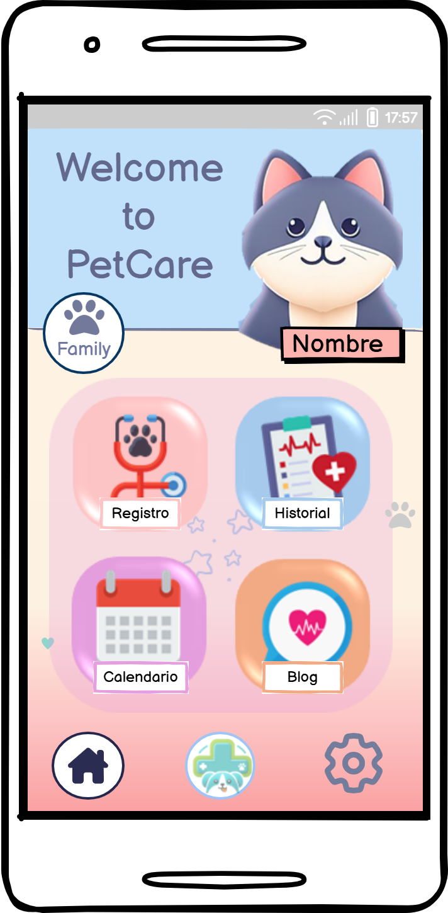
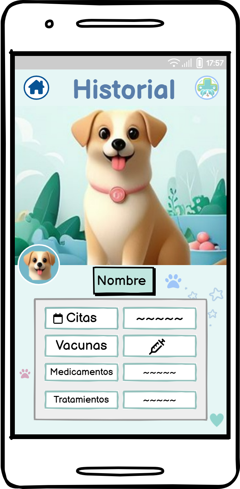
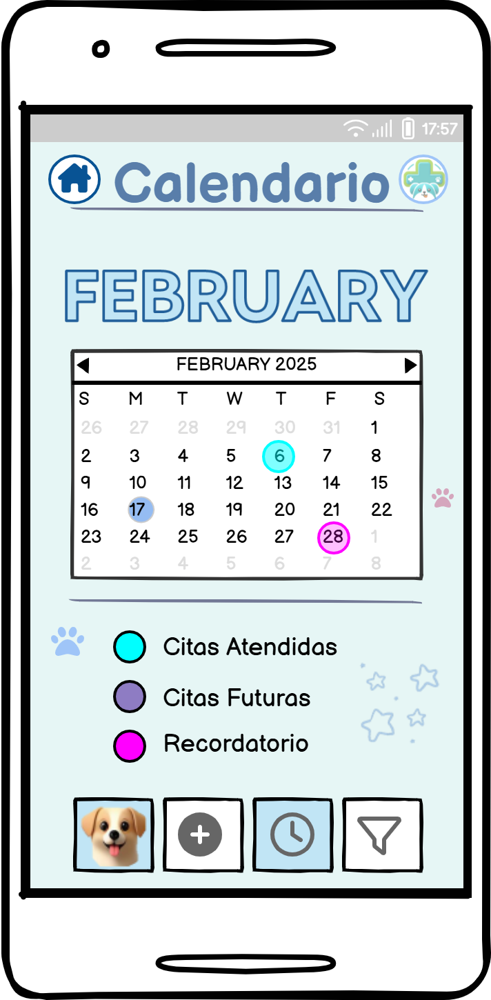

# Diseño de interfaz de usuario

La interfaz de usuario de la aplicación PetCare esta diseñada para ser intuitiva, llamativa a la
vista, y amigable con el usuario. 
Los colores a usar son en su mayoría tonos pastel y tonos vivos. 

El diseño completo interactivo de PetCare está disponible en Marvel App.
[Diseño interactivo - Marvel App](https://marvelapp.com/prototype/acbj018) 

A continuación se presentan las principales pantallas:

1. Pantalla Principal

   Después de autenticarse o registrar la mascota y escoger el perfil, el usuario podrá gestionar
   su mascota desde la pantalla principal

   

2. Historial médico

   Desde aquí, el usuario podrá gestionar la salud de su mascota, llevando el registro electrónico
   de vacunas, citas y otros.

   

3. Calendario

   Aquí el usuario podrá configurar recordatorios, y gestionar las citas médicas de su mascota.

   
